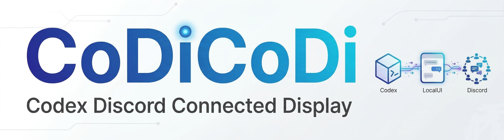

# Codex Discord Connected Display

Codex Discord Connected Display は、1つの Codex CLI セッションを

- PC 上のローカル UI
- Discord の指定チャンネル

の両方から共有して使うための、Windows 向けローカルアプリです。略称は `CoDiCoDi` です。

このリポジトリは、現時点の動作する状態をオープンソースとして公開するためのスナップショットです。すでに実用はできますが、まだ改修途中の部分もあります。

## 重要: 先に安全上の注意を読んでください

このアプリは便利ですが、かなり強い権限を持つローカルツールです。

- 入力した文章、画像、添付ファイル、保存済みファイルのパスを Codex CLI に渡します
- 会話内容を Discord に送ります
- 設定によっては、Codex に外部ネットワークアクセスを許可します
- 設定によっては、Codex を承認なし・sandbox 制限なしで実行します
- 設定によっては、監視フォルダ内で変更されたファイルを Discord に自動投稿します

設定を誤ると、機密情報の流出、不要なファイル送信、Discord Bot の乗っ取り、ローカル PC 上の危険な操作につながる可能性があります。

特に次の使い方は避けてください。

- 公開 Discord サーバーで使う
- 信頼できない人が書き込めるチャンネルで使う
- 機密データが大量に入った PC で、設定を理解しないまま使う
- ローカル bridge を外部ネットワークへ公開する

まずは [SECURITY.md](SECURITY.md) を読んでください。

## おすすめの導入方法

codex等のAIチャットに以下のプロンプトを入力してください。

```text
https://github.com/harunamitrader/codicodiを導入して。可能な範囲でAI側で作業を行い、必要な情報があれば質問して。手動で行う必要があるものは丁寧にやり方を教えて。Tauri デスクトップアプリとして起動できるようにデスクトップにショートカットを作成して
```

この方法なら、非エンジニアの人でも「どこを自分で触る必要があるか」を分けながら進めやすいです。特におすすめの導線は、**インストーラーを使わずに、このリポジトリをそのまま Tauri デスクトップアプリとして起動する方法**です。

## このプロジェクトでできること

現時点では、主に次のことができます。

- セッションの新規作成、切り替え、名前変更、削除
- ローカル UI と Discord で同じ Codex セッションを共有
- ローカル UI / Discord の両方から文章を送信
- ローカル UI / Discord の両方から画像を送信
- ローカル UI / Discord の両方からファイルを送信
- セッションごとに model / reasoning / fast mode を切り替え
- 実行中の Codex を停止
- UI と Discord に進捗表示
- 再起動後の stale session 復旧と `Restore Chat`
- 途中メッセージやコマンド実行メッセージの表示
- キュー待ちターン数の表示
- ローカル UI での drag & drop / paste 添付
- セッションごとの working directory 切り替え
- cron スケジュールで既存セッションまたは新規セッションへ定期送信
- 開発者コンソール表示
- Discord チャンネルとセッションの紐付け
- 指定フォルダ配下のファイル変更を Discord に通知
- Tauri デスクトップアプリとして起動

補足:

- Codex の `review` 実行機能は、現時点では UI / bridge ともに提供していません

## 想定している使い方

このプロジェクトは、次のような人を想定しています。

- Windows で Codex CLI を使っている
- Discord とローカル UI の両方から同じ作業セッションを続けたい
- `.env` や Discord Bot 設定を自分で管理できる

逆に、次の用途には向いていません。

- 一般ユーザー向けの完成品アプリとして使う
- 不特定多数が使う共有サービスにする
- セキュリティを厳密に求める企業向けシステムとして使う
- インターネット公開サービスにする

## 全体構成

このプロジェクトは大きく 3 つの層に分かれています。

1. `server/`
   Node.js 製のローカル bridge 本体です。Codex CLI の起動、Discord 連携、SQLite 保存、添付ファイル保存、SSE 配信などを担当します。
2. `ui/`
   ブラウザ UI です。ローカルブラウザ表示と Tauri アプリ内表示の両方で使います。
3. `src-tauri/`
   Windows 用デスクトップラッパーです。bridge を自動起動して、専用ウィンドウで UI を開きます。

詳しい仕様は [docs/SPECIFICATION.md](docs/SPECIFICATION.md) にまとめています。

## 事前に必要なもの

このアプリは単体では動きません。事前に以下が必要です。

### 1. Windows PC

現在は Windows 前提の実装です。

### 2. Node.js

`npm` が使える Node.js が必要です。

推奨:

- Node.js 22 LTS 以上

確認方法:

```powershell
node -v
npm -v
```

### 3. Codex CLI

このアプリは、あなたのローカル PC に入っている Codex CLI を呼び出して使います。

先に次が通ることを確認してください。

```powershell
codex --help
```

重要:

- このアプリ自体が AI を持っているわけではありません
- 実際に動いているのはローカルの Codex CLI です
- Codex CLI の導入とログインが済んでいないと動きません

### 4. Discord Bot

Discord 連携を使うには、自分の Discord Bot が必要です。

なお、現状の実装では `.env` の `DISCORD_ALLOWED_GUILD_IDS` に **ちょうど1つの Discord サーバー ID** が入っていることを前提にしています。

## 導入手順

ここでは、**インストーラーを使わずに Tauri デスクトップアプリとして起動する方法**をメイン導線として説明します。
非エンジニアの人でも追いやすいように、順番に説明します。

### 手順 1. このプロジェクトを手元に置く

Git を使う場合:

```powershell
git clone <GitHub のリポジトリ URL>
cd codicodi
```

Git が分からない場合は、GitHub の `Code` ボタンから ZIP をダウンロードして展開してください。

### 手順 2. Node.js の依存パッケージを入れる

PowerShell でプロジェクトフォルダを開き、次を実行します。

```powershell
npm install
```

### 手順 3. Codex CLI が使えることを確認する

PowerShell で次を実行します。

```powershell
codex --help
```

ここで失敗する場合は、先に Codex CLI のインストールとログインを済ませてください。

### 手順 4. Discord Bot を作成する

1. Discord Developer Portal を開く
2. 新しい Application を作る
3. `Bot` タブを開く
4. Bot を作成する
5. Bot Token をコピーする
6. `Message Content Intent` を有効にする

このトークンはあとで `.env` に設定します。漏洩すると Bot を乗っ取られる可能性があるため、絶対に公開しないでください。

### 手順 5. Bot を Discord サーバーに招待する

Developer Portal の `OAuth2` -> `URL Generator` で、以下を設定してください。

Scope:

- `bot`
- `applications.commands`

Permission の目安:

- `View Channels`
- `Send Messages`
- `Read Message History`
- `Add Reactions`
- `Attach Files`

生成された URL を開き、自分の Discord サーバーへ Bot を追加します。

公開サーバーではなく、自分専用か、十分に信頼できるサーバーで使ってください。

### 手順 6. Discord の Developer Mode を有効にする

サーバー ID やチャンネル ID を取るために必要です。

Discord で:

1. `ユーザー設定`
2. `詳細設定`
3. `Developer Mode` を ON

その後、

- サーバーを右クリックして `Copy Server ID`
- 必要ならチャンネルを右クリックして `Copy Channel ID`

を行います。

### 手順 7. `.env` を作る

まず、サンプルファイルをコピーします。

```powershell
Copy-Item .env.example .env
```

その後、`.env` をテキストエディタで開いて、最低限次を埋めてください。

```env
PORT=3087
HOST=127.0.0.1
CODEX_COMMAND=codex
CODEX_WORKDIR=C:\Users\your-name\Desktop\codex
CODEX_ENABLE_SEARCH=true
CODEX_BYPASS_APPROVALS_AND_SANDBOX=true
DATA_DIR=./data
DISCORD_BOT_TOKEN=your-bot-token
DISCORD_ALLOWED_GUILD_IDS=your-server-id
DISCORD_ALLOWED_CHANNEL_IDS=
DISCORD_STATUS_UPDATES=true
FILE_WATCH_ENABLED=false
FILE_WATCH_ROOT=
FILE_LOG_CHANNEL_ID=
```

主な意味:

- `CODEX_COMMAND`
  Codex CLI を起動するコマンド名です。通常は `codex` のままで大丈夫です。
- `CODEX_WORKDIR`
  Codex が標準で作業するフォルダです。UI から選べる作業フォルダや、スケジュール実行時の既定フォルダはこの配下に制限されます。
- `DISCORD_BOT_TOKEN`
  自分の Discord Bot Token です。絶対に GitHub に上げないでください。
- `DISCORD_ALLOWED_GUILD_IDS`
  現在の実装では 1 つだけ指定します。
- `DISCORD_ALLOWED_CHANNEL_IDS`
  空欄なら、そのサーバー内の選択可能チャンネル一覧から選べます。指定すると、その ID のチャンネルだけを使えるように絞れます。

### 手順 8. Tauri デスクトップアプリとして起動する

このプロジェクトでは、まずこの起動方法をおすすめします。

PowerShell で次を実行します。

```powershell
.\launch-tauri-dev.ps1
```

または、同じ内容を直接実行しても構いません。

```powershell
npm run tauri:dev
```

注意:

- 現時点の Tauri 版も、内部ではローカルの Node.js と Codex CLI を前提にしています
- つまり、完全な単独バイナリではなく、ローカル bridge を起動するデスクトップラッパーです
- Tauri 版ではウィンドウを閉じる前に確認ダイアログが表示されます

### 手順 9. 代替: ブラウザから起動する

サーバーだけ起動するなら次を実行します。

```powershell
npm run start
```

ブラウザまでまとめて開くなら、次の補助スクリプトも使えます。

```powershell
.\launch-browser.ps1
```

または:

```powershell
.\launch-browser.cmd
```

手動で開く場合は、ブラウザで次を開きます。

```text
http://127.0.0.1:3087
```

### 手順 10. 任意: build 済み exe を直接起動する

インストーラーは使わず、build 済みの release exe を直接起動したい場合は、`npm run tauri:build` 実行後に `launch-direct.ps1` を使えます。

```powershell
npm run tauri:build
.\launch-direct.ps1
```

## アプリの使い方

### ローカル UI

ローカル UI では次の操作ができます。

- `New Session` で新規セッション作成
- セッションカードをクリックして名前変更
- Discord Channel カードをクリックしてチャンネル紐付け
- Model / Reasoning / Fast mode の切り替え
- `Select Folder` でセッションごとの working directory 切り替え
- メッセージ送信
- ファイル追加
- drag & drop / paste での添付追加
- 実行中停止
- `Restore Chat` による DB からの会話再取得と stale session 復旧
- `Open Developer Console`
- `Schedules` 画面で cron スケジュールの追加 / 編集 / 停止 / 削除
- スケジュールごとの送信先を「既存セッション」または「新規セッション作成」から選択
- セッション削除

### Discord コマンド

現在の slash command は次の通りです。

- `/codex help`
- `/codex session`
- `/codex session number:1`
- `/codex new`
- `/codex rename name:新しい名前`
- `/codex status`
- `/codex model`
- `/codex model number:1`
- `/codex reasoning`
- `/codex reasoning number:2`
- `/codex fast on`
- `/codex fast off`
- `/codex stop`

旧形式のテキストコマンド:

- `!status`
- `!new`
- `!bind <sessionId>`

### 添付ファイル

- 画像は Codex CLI の `--image` で渡します
- 画像以外のファイルはローカルに保存し、その保存パスをプロンプトに追記して Codex に見せます
- ローカル UI ではファイル picker に加えて drag & drop / paste に対応しています
- 保存場所は `data/uploads/` です

### ファイル変更通知

`.env` で有効にすると、指定フォルダ配下の

- 新規作成
- 変更
- 削除

を Discord の専用ログチャンネルへ通知できます。

新規作成と変更については、サイズ制限内ならファイル自体も添付されます。

## このアプリが保存するデータ

このアプリは、標準ではプロジェクトフォルダ内にデータを保存します。

主な保存先:

- `data/bridge.sqlite`
  セッション情報とイベント履歴
- `data/uploads/`
  添付ファイル
- `data/logs/`
  developer console 用ログ
- `.env`
  Bot Token や設定値

これらを誰かに見られると、会話内容、ファイル名、添付ファイル、設定、作業履歴が漏れる可能性があります。

## 安全に使うためのチェックリスト

実運用前に、最低限これを確認してください。

- 自分が管理する Windows PC で使う
- 自分が管理する Discord サーバーで使う
- Bot のアクセスチャンネルを必要最小限にする
- `.env` を Git に入れない
- Bot Token が漏れたらすぐ再発行する
- 機密ファイルがあるフォルダを監視対象にしない
- `CODEX_ENABLE_SEARCH` と `CODEX_BYPASS_APPROVALS_AND_SANDBOX` を理解して使う
- bridge のポートを外部へ公開しない

## 現在の制約

現在の制約は次の通りです。

- Windows 前提の実装が多い
- Tauri 版も Node.js と Codex CLI のローカル導入が必要
- 複数人共用の安全なサービスとしては設計されていない
- 厳密な認証や権限管理はない
- インターネット公開用途は想定していない

## オープンソース公開用に含めているファイル

- [README.md](README.md)
  導入手順と概要
- [docs/SPECIFICATION.md](docs/SPECIFICATION.md)
  現時点の仕様書
- [SECURITY.md](SECURITY.md)
  セキュリティ上の注意
- [NOTICE.md](NOTICE.md)
  商標・第三者ソフトウェアに関する注意
- [LICENSE](LICENSE)
  ライセンス原文
- [LICENSE.ja.md](LICENSE.ja.md)
  ライセンスの日本語説明
- [CHANGELOG.md](CHANGELOG.md)
  変更履歴
- [launch-direct.ps1](launch-direct.ps1)
  build 済みの Tauri exe を直接起動する補助スクリプト
- [launch-tauri-dev.ps1](launch-tauri-dev.ps1)
  Tauri 開発モード起動スクリプト

## 責任範囲について

このプロジェクトを使う場合、最終的な責任は利用者にあります。

特に次については、利用者自身が管理してください。

- Codex / OpenAI 側の利用条件
- Discord Bot の設定と保護
- ローカル PC の安全性
- 送信するファイルやメッセージの内容
- 外部サービスの規約順守

このリポジトリは OpenAI、Discord、Tauri の公式プロジェクトではありません。
